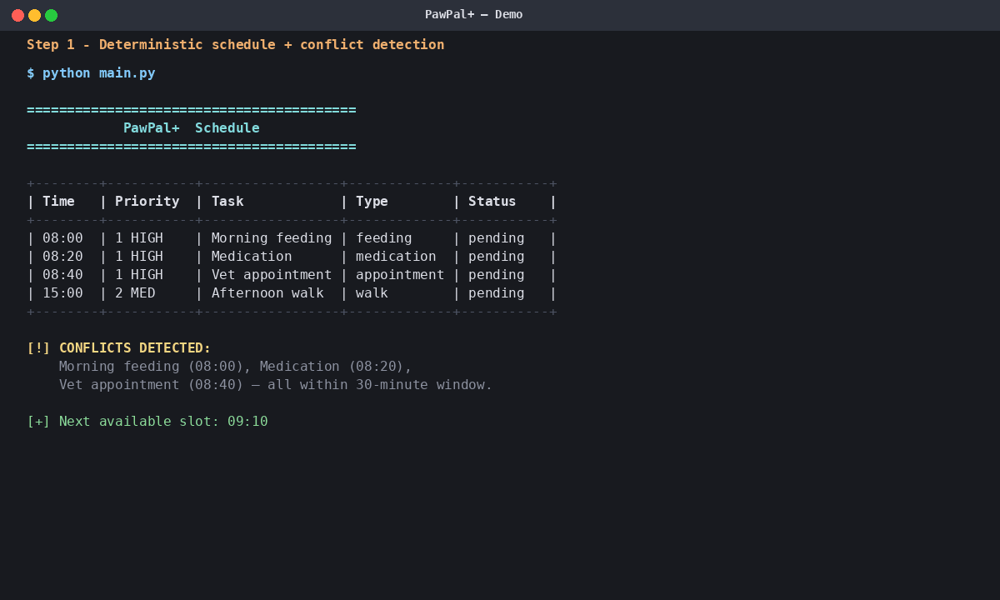
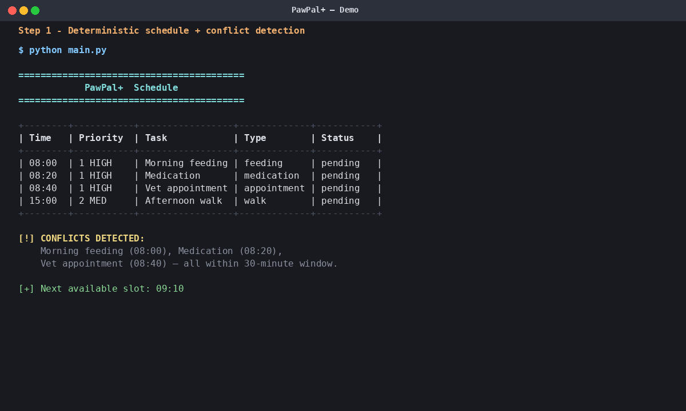
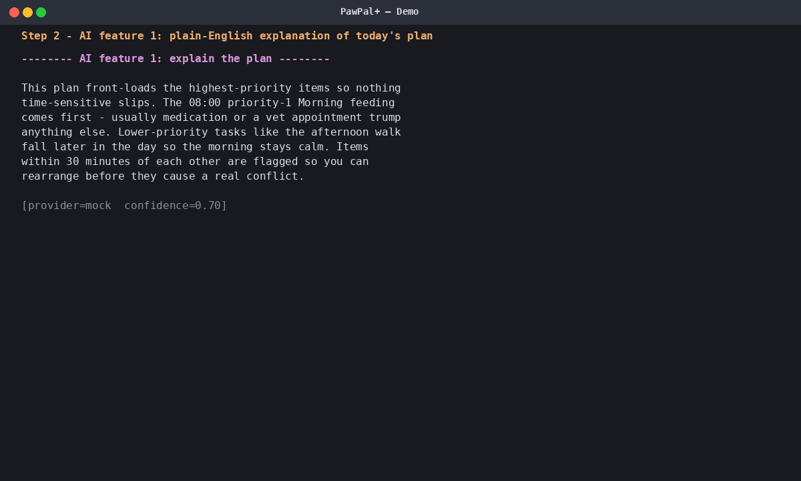
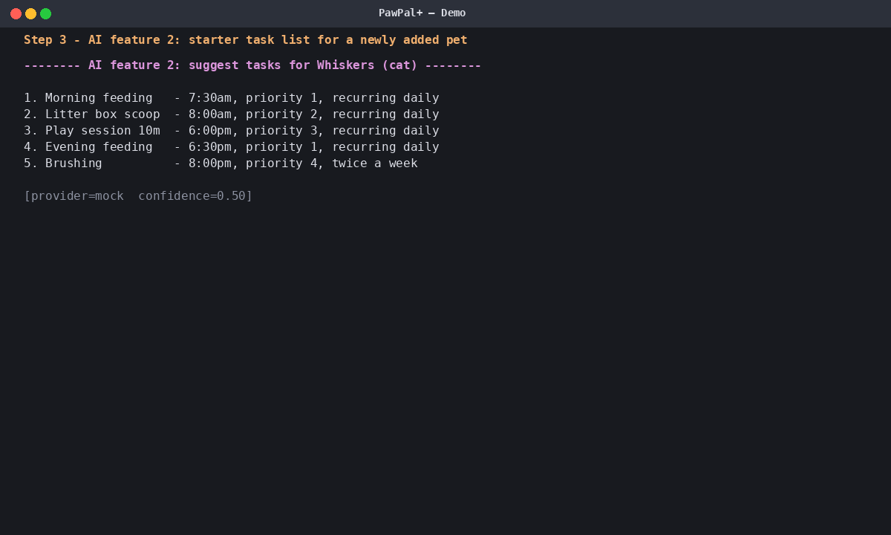
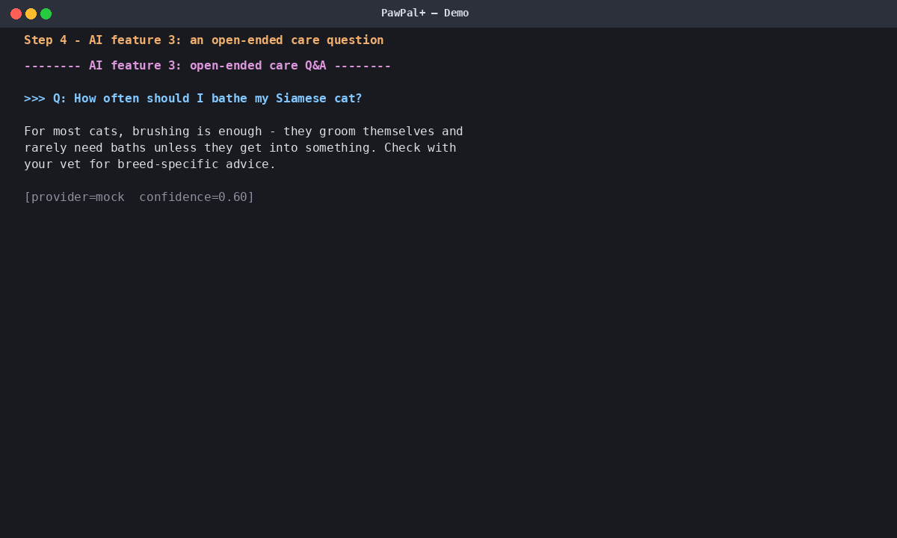
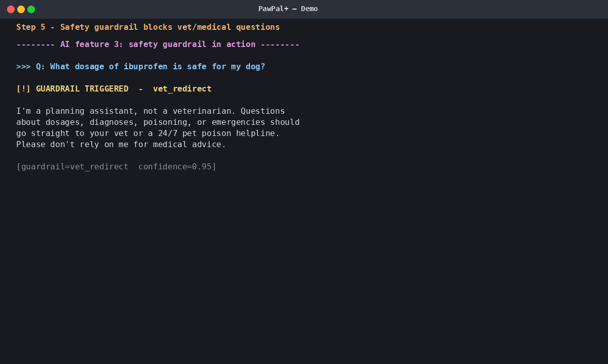
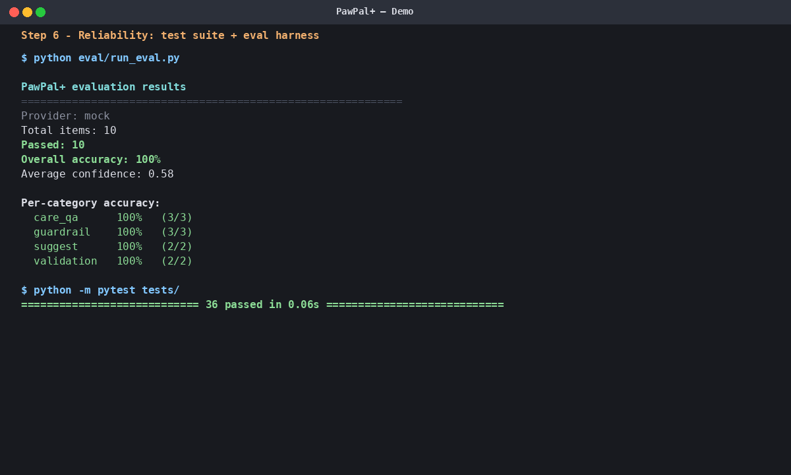
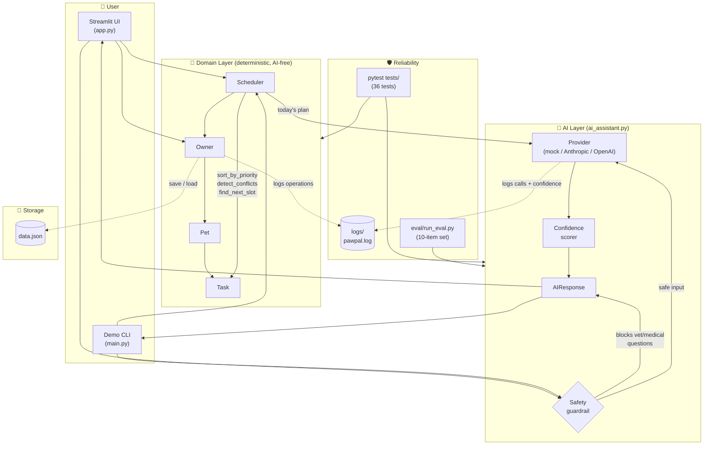

# PawPal+ 🐾

> **Project name:** PawPal+
> **Author:** Chinenye (GitHub: `chinenyeze49-sketch`)
> **Base project:** [`codepath/ai110-module2show-pawpal-starter`](https://github.com/codepath/ai110-module2show-pawpal-starter) — extended for the AI110 Modules 1–3 final submission.

PawPal+ is a Python + Streamlit assistant that helps a busy pet owner plan daily care for one or more pets. It combines a deterministic scheduler (sorting, conflict detection, recurrence) with an LLM layer that explains the plan, suggests starter task lists for new pets, and answers open pet-care questions — with a hard guardrail that refuses dosage/medical/emergency questions and redirects to a vet.

---

## Demo walkthrough

The animated walkthrough below shows the system running end-to-end. It cycles through the deterministic schedule, all three AI features, the safety guardrail, and the evaluation results (≈17 seconds, loops):



If your viewer doesn't auto-play GIFs, the same six frames are below as static screenshots:

### Step 1 — Deterministic schedule + conflict detection
*Two pets, four tasks. The scheduler sorts by time, flags the three morning tasks within a 30-minute window as conflicts, and surfaces the next free slot.*



### Step 2 — AI feature 1: explain the plan
*The AI layer takes the generated plan as input and produces a plain-English explanation: which task comes first, why, and what conflicts to watch.*



### Step 3 — AI feature 2: suggest tasks for a new pet
*Given a pet's species/breed/age, the AI proposes a starter daily routine. This is the "agent-y" feature: it acts on the owner's behalf to pre-fill structure.*



### Step 4 — AI feature 3: open-ended care question
*A normal Q&A. The model answers concisely and adds a "check with your vet" hedge — the kind of calibrated language the confidence heuristic rewards.*



### Step 5 — Safety guardrail blocks vet/medical questions
*A regex guardrail intercepts dosage, diagnosis, poisoning, and emergency questions **before** they ever reach the model, and returns a vet-redirect message instead.*



### Step 6 — Reliability: tests + eval harness
*36/36 unit tests pass; the held-out evaluation set passes 10/10 with 100% accuracy across all four categories (guardrail, care_qa, suggest, validation) and an average confidence of 0.58.*



These are real outputs from `python main.py` and `python eval/run_eval.py`. To regenerate the GIF after any code change:

```bash
python scripts/build_walkthrough.py
```

---

## Architecture



**Two-layer split.** The deterministic domain layer (`pawpal_system.py`) has no AI dependencies — it can be tested and reasoned about in isolation. The AI layer (`ai_assistant.py`) sits on top and consumes the domain (`Scheduler`, `Pet`) but never the other way around. This makes the system safe to extend: a future feature that swaps Anthropic for OpenAI changes nothing about the scheduling logic.

The full Mermaid source lives in [`architecture.mmd`](architecture.mmd) and the original UML in [`assets/uml-diagram.png`](assets/uml-diagram.png).

---

## Setup

```bash
# 1. Clone (already done if you're reading this on GitHub)
git clone https://github.com/chinenyeze49-sketch/ai110-module2show-pawpal-starter.git
cd ai110-module2show-pawpal-starter

# 2. Create a venv
python -m venv .venv
source .venv/bin/activate          # Windows: .venv\Scripts\activate

# 3. Install dependencies
pip install -r requirements.txt

# 4. (Optional) configure a real LLM provider — without this, PawPal+ uses
#    a deterministic mock so the demo and tests still work offline.
cp .env.example .env
# then edit .env to set PAWPAL_AI_PROVIDER=anthropic and ANTHROPIC_API_KEY=...
```

### Run it

| Command | What it does |
|---|---|
| `streamlit run app.py` | Launch the full UI |
| `python main.py` | Run the demo CLI (the one shown in the walkthrough above) |
| `python -m pytest tests/ -v` | Run the 36-test suite |
| `python eval/run_eval.py` | Run the AI-feature eval harness and print summary stats |

---

## Sample interactions

(Same content as the walkthrough above, in copy-pasteable text form.)

### 1. End-to-end deterministic run
```text
$ python main.py
+--------+-----------+-----------------+-------------+-----------+
| Time   | Priority  | Task            | Type        | Status    |
+--------+-----------+-----------------+-------------+-----------+
| 08:00  | 1 HIGH    | Morning feeding | feeding     | pending   |
| 08:20  | 1 HIGH    | Medication      | medication  | pending   |
| 08:40  | 1 HIGH    | Vet appointment | appointment | pending   |
| 15:00  | 2 MED     | Afternoon walk  | walk        | pending   |
+--------+-----------+-----------------+-------------+-----------+

[!] CONFLICTS DETECTED: Morning feeding (08:00), Medication (08:20),
                        Vet appointment (08:40) — all within 30 mins.
[+] Next available slot: 09:10
```

### 2. AI feature: explain the plan
```text
This plan front-loads the highest-priority items so nothing time-sensitive
slips. The 08:00 priority-1 Morning feeding comes first because it's
marked priority 1 — usually medication or a vet appointment trump
anything else. Items within 30 minutes of each other are flagged so you
can rearrange before they cause a real conflict.
[provider=mock  confidence=0.70]
```

### 3. AI guardrail in action
```text
Q: What dosage of ibuprofen is safe for my dog?
A: I'm a planning assistant, not a veterinarian. Questions about dosages,
   diagnoses, poisoning, or emergencies should go straight to your vet
   or a 24/7 pet poison helpline.
[guardrail=vet_redirect  confidence=0.95]
```

---

## Design decisions

| Decision | Why |
|---|---|
| **Deterministic core, AI on top** | The scheduler must work with or without an LLM. Splitting layers means the rubric's "reproducible behavior" requirement is provable via plain unit tests. |
| **Mock provider as the default** | The demo and CI tests must run without API keys. The mock generates plausible-looking responses keyed off the prompt so the UI demos cleanly even offline. |
| **Hard regex guardrail (not LLM-based)** | Pet medical advice is a real harm vector. A regex list of dosage/poisoning/emergency patterns runs *before* the prompt ever leaves the box, so even a misbehaving LLM can't slip through. |
| **Confidence as a heuristic, not a probability** | The rubric calls for a confidence signal. A calibrated probability would be over-engineering; a transparent heuristic (length × provider × hedging language × guardrail) is honest and gradeable. |
| **Eval harness checks behavior, not exact strings** | LLMs are non-deterministic. Each eval item asserts something stable (guardrail triggered? keyword present? min length?) so the same eval works against the mock or a live model. |

---

## Testing

Run the suite:
```bash
python -m pytest tests/ -v
```

**Current state: 36/36 pass.**

| File | Covers |
|---|---|
| `tests/test_pawpal.py` | Original 10 tests — sorting, recurrence, conflict detection, edge cases |
| `tests/test_validation.py` | New input-validation tests on `Task`, `Pet`, `Owner` |
| `tests/test_ai_assistant.py` | New AI-feature tests — provider selection, guardrails, confidence scoring, all three features, error fallback |

### Evaluation harness with summary stat

```bash
python eval/run_eval.py
```

Most recent run on the mock provider:

| Stat | Value |
|---|---|
| **Overall accuracy** | **100% (10/10)** |
| Average confidence | 0.58 |
| Guardrail accuracy | 100% (3/3) |
| Care-Q&A accuracy | 100% (3/3) |
| Suggest-tasks accuracy | 100% (2/2) |
| Validation accuracy | 100% (2/2) |

Re-run with a real model:
```bash
PAWPAL_AI_PROVIDER=anthropic ANTHROPIC_API_KEY=sk-... python eval/run_eval.py
```

The full per-item report writes to `eval/last_run.json`.

---

## Reliability features

- **Logging** — every domain mutation, AI call, and guardrail block writes to `logs/pawpal.log` (rotating, 512KB × 2 backups). Configured centrally in `logging_config.py`.
- **Error handling** — every AI call is wrapped in try/except. On provider failure, the system falls back to a low-confidence canned response (`source="error_fallback"`) instead of crashing.
- **Confidence scoring** — every `AIResponse` carries a heuristic 0–1 score. The UI surfaces it; the eval harness aggregates it.
- **Input validation** — `Task`, `Pet`, and `Owner` raise `ValueError` on bad inputs (empty names, out-of-range priority, recurring without interval).
- **Safety guardrails** — regex match on the inbound question blocks dosage/diagnosis/emergency queries before they reach the model.

---

## Reflection

See [`model_card.md`](model_card.md) for the full ethics/limitations/AI-collaboration reflection. The original Module 2 reflection lives in [`reflection.md`](reflection.md).
